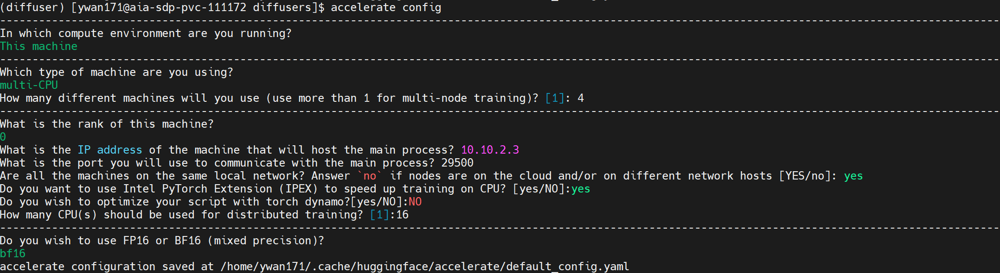
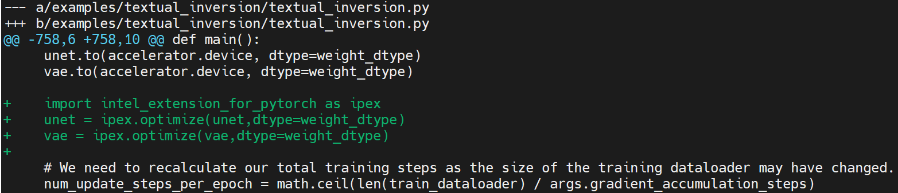

# Distributed Stable Diffusion Textual Inversion Finetuning w/ multi-node CPU 

## env setup
```shell
conda create -n diffuser python==3.9
conda activate diffuser
conda install gperftools -c conda-forge
pip3 install torch torchvision torchaudio --index-url https://download.pytorch.org/whl/cpu
pip install transformers
pip install accelerate
python -m pip install intel_extension_for_pytorch
python -m pip install oneccl_bind_pt -f https://developer.intel.com/ipex-whl-stable-cpu
```

## get diffusers
``` shell
git clone https://github.com/huggingface/diffusers.git
cd diffusers
pip install .
```

## configure accelerate
```shell
accelerate config
```


## set env variables
``` shell
oneccl_bindings_for_pytorch_path=$(python -c "from oneccl_bindings_for_pytorch import cwd; print(cwd)")
source $oneccl_bindings_for_pytorch_path/env/setvars.sh

export LD_PRELOAD=${LD_PRELOAD}:${CONDA_PREFIX}/lib/libiomp5.so
export LD_PRELOAD=${LD_PRELOAD}:${CONDA_PREFIX}/lib/libtcmalloc.so

export CCL_ATL_TRANSPORT=ofi
export CCL_WORKER_COUNT=1 (enable ccl to work with ipex bf16 training, ccl offers optimization for bf16)
 
export MODEL_NAME="runwayml/stable-diffusion-v1-5"
export DATA_DIR="/panfs/users/ywan171/dicco"
```

## change a bit on `examples/textual_inversion/textual_inversion.py` to enjoy IPEX inference boost



## finetune
In this case, we use 1 dicoo image to do the few-shot finetuing, and we use 1 virtual token as soft prompt.


``` shell
mpirun -f nodefile -n 8 -ppn 1 accelerate launch textual_inversion.py \
  --pretrained_model_name_or_path=$MODEL_NAME \
  --train_data_dir=$DATA_DIR \
  --learnable_property="object" \
  --placeholder_token="<dicoo>" --initializer_token="toy" \
  --resolution=512 \
  --train_batch_size=1 \
  --seed=7 \
  --gradient_accumulation_steps=1 \
  --max_train_steps=200 \
  --learning_rate=2.0e-03 --scale_lr \
  --lr_scheduler="constant" \
  --lr_warmup_steps=0 \
  --output_dir=./textual_inversion_cat \
  --mixed_precision bf16 \
  --save_as_full_pipeline
```

## inference
Once you are done, you can refer to the `run_inference.py` to do the inference.
